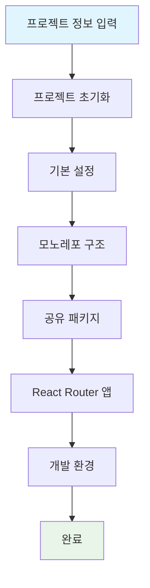

# prj.sh
> 웹 프론트엔드 프로젝트 스케폴드 자동화 스크립트

## 빠른 시작

**즉시 실행:**
```shell
curl -L https://github.com/shoveller/initial-script-recipes/raw/main/prj.sh | bash
```

또는 **다운로드 후 실행:**
```shell
curl -L -o prj.sh https://github.com/shoveller/initial-script-recipes/raw/main/prj.sh && chmod +x prj.sh && ./prj.sh
```

## 실행 흐름



## 생성되는 구조

```
my-project/
├── apps/
│   └── web/                 # React Router 웹 앱
├── packages/
│   ├── eslint/             # 공유 ESLint 설정
│   ├── prettier/           # 공유 Prettier 설정
│   └── scripts/            # 공유 유틸리티 스크립트
├── .github/workflows/      # CI/CD (semantic-release, AWS 배포)
├── package.json            # 루트 패키지 설정
├── pnpm-workspace.yaml     # PNPM 워크스페이스
├── turbo.json             # Turborepo 설정
└── .vscode/               # VS Code 워크스페이스
```

## 주요 기능

- **모노레포**: PNPM + Turborepo
- **CI/CD**: GitHub Actions + semantic-release
- **코드 품질**: ESLint + Prettier + Husky
- **개발 환경**: VS Code 워크스페이스 자동 설정
- **AWS 배포**: Lambda + S3 배포 워크플로우 (선택)
- **템플릿 기반**: GitHub에서 최신 템플릿 자동 다운로드
