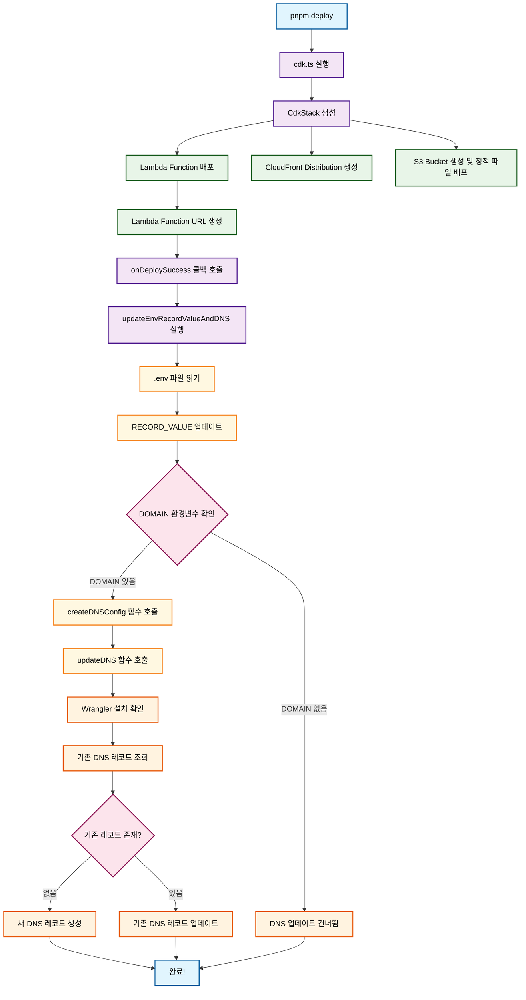

# Infrastructure Package

AWS CDK와 Cloudflare DNS를 사용한 자동화된 배포 시스템입니다.

## 🚀 주요 기능

- **AWS CDK 배포**: Lambda Function URL과 CloudFront 배포
- **자동 DNS 업데이트**: Cloudflare DNS 레코드 자동 관리
- **환경변수 자동 업데이트**: 배포 후 .env 파일 자동 갱신

## 📋 실행 흐름



## 🛠️ 스크립트 명령어

### 배포 관련
- `pnpm bootstrap`: CDK 부트스트랩 및 첫 배포
- `pnpm deploy`: CDK 배포 (hotswap 모드)
- `pnpm destroy`: CDK 스택 삭제

### DNS 관리
- `pnpm update-dns`: Wrangler CLI로 DNS 업데이트

## 🔧 환경변수 설정

### 필수 환경변수
```bash
# AWS 관련
AWS_ACCOUNT_ID=your-aws-account-id
AWS_DEFAULT_REGION=ap-northeast-2

# Cloudflare 관련 (DNS 업데이트 시 필요)
CLOUDFLARE_API_TOKEN=your-cloudflare-api-token
CLOUDFLARE_ACCOUNT_ID=your-cloudflare-account-id
```

### DNS 업데이트 관련 환경변수
```bash
# 도메인 설정 (선택사항 - 없으면 DNS 업데이트 건너뜀)
DOMAIN=example.com
SUBDOMAIN=api  # 선택사항 - 없으면 메인 도메인 사용

# DNS 레코드 설정
RECORD_TYPE=CNAME
RECORD_VALUE=lambda-url.amazonaws.com  # 자동 업데이트됨
TTL=300
```

## 📝 환경변수 설정 규칙

### DOMAIN 처리
- **DOMAIN이 설정되지 않은 경우**: DNS 업데이트를 완전히 건너뜁니다
- **DOMAIN이 설정된 경우**: DNS 업데이트를 진행합니다

### SUBDOMAIN 처리
- **SUBDOMAIN이 없는 경우**: 메인 도메인(example.com)에 레코드 설정
- **SUBDOMAIN이 있는 경우**: 서브도메인(api.example.com)에 레코드 설정

## 🌐 DNS 업데이트 방식

### Wrangler CLI 방식
```bash
pnpm update-dns
```

## 🔄 자동화된 배포 프로세스

1. **CDK 배포**: `pnpm deploy` 실행
2. **Lambda 생성**: AWS Lambda Function URL 생성
3. **환경변수 업데이트**: .env 파일의 RECORD_VALUE 자동 업데이트
4. **DNS 업데이트**: Cloudflare DNS 레코드 자동 업데이트 (DOMAIN이 설정된 경우)

## ⚠️ 주의사항

- **DOMAIN 환경변수가 없으면** DNS 업데이트는 자동으로 건너뜁니다
- **Wrangler CLI 사용 시** `wrangler` 명령어가 전역으로 설치되어야 합니다

## 🚨 트러블슈팅

### DNS 업데이트 실패 시
배포는 성공했지만 DNS 업데이트가 실패한 경우 수동으로 실행:
```bash
cd packages/infra
pnpm update-dns
```

### Wrangler CLI 설치
```bash
npm install -g wrangler
```